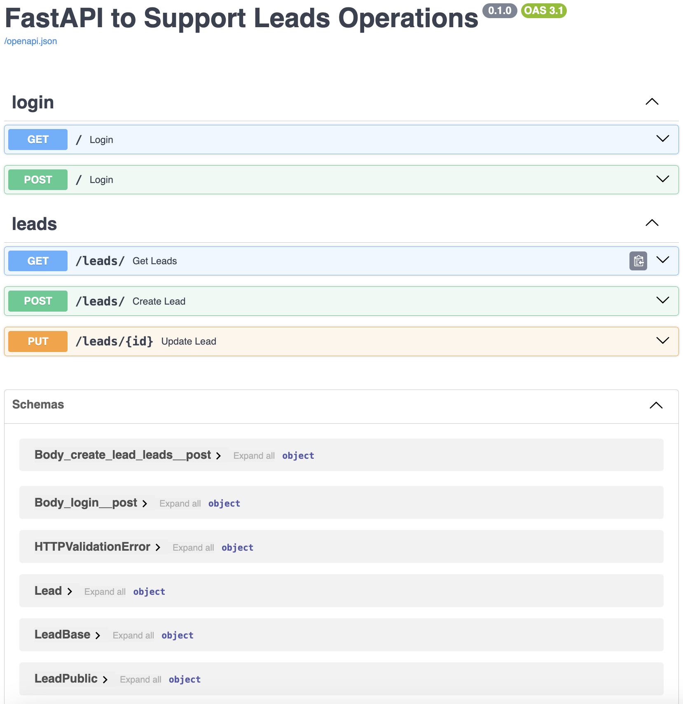

# Backend App

## Design document

Refer to [design.md](./design.md) for more details.

## Source file structure
```
├── app/                 # top level package
│   └── routers/         # subpackage
│   │   ├── leads.py     # endpoints for Lead model
│   │   └── login.py     # endponits for login
│   ├── backend_pre_start.py
│   ├── config.py
│   ├── deps.py          # common dependencies used by various models
│   ├── initial_data.py
│   ├── main.py          # app entry point
│   ├── models.py        # both Pydantic models and SQL models
│   ├── utils.py
```

## How to run the app

* First clone the repository

```commandline
git clone git@github.com:MingDevp/leads.git
```

* Go to `./leads` folder, establish a virtual environment, install Python packages
```commandline
cd ./leads
python3 -m env venv
source venv/bin/activate
pip install fastapi
pip install sqlalchemy
pip install sqlmodel
pip install psycopg2-binary
```

* Go to `./app` folder, run the liver server
```commandline
cd ./app
fastapi dev main.py
```

Should be able to check API documentation at http://127.0.0.1:8000/docs/

[](https://github.com/MingDevp/leads)

If seeing error like `ModuleNotFoundError: No module named 'passlib'`, need to install the package
```commandline
pip install passlib
```

* Script `prestart.sh` first starts PostgreSQL db, then create tables. This script is taken from
https://github.com/tiangolo/full-stack-fastapi-template. Running the script gives me error
`(psycopg.OperationalError) [Errno 8] nodename nor servname provided, or not known`. There is a problem
to be fixed in my setting up PostgreSQL.
